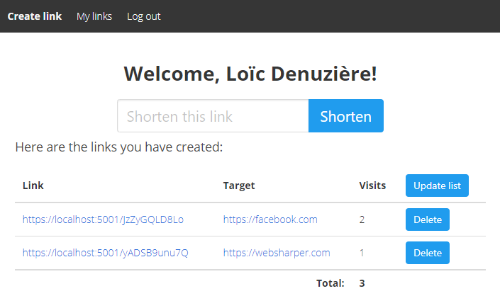
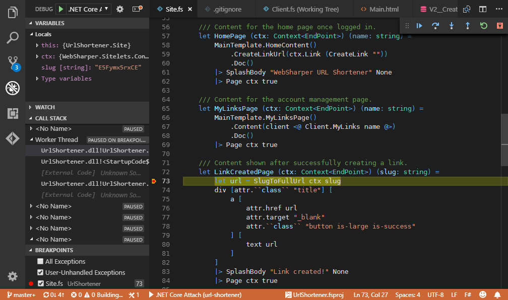
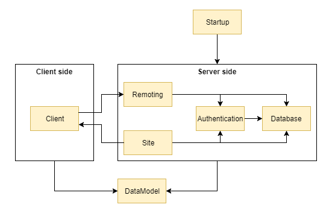

# WebSharper URL Shortener

This project demonstrates how to use [WebSharper](https://websharper.com) to build the server side and client side of a web application.

It features:
* a server side using [WebSharper sitelets](https://developers.websharper.com/docs/v4.x/fs/sitelets) hosted on ASP.NET Core;
* a SQLite database driven by [SQLProvider](https://fsprojects.github.io/SQLProvider/), with schema migrations using [Evolve](https://evolve-db.netlify.com/);
* Facebook login using OAuth;
* a [Model-View-Update](https://dotnet-websharper.github.io/mvu) client side page, using [WebSharper remoting](https://developers.websharper.com/docs/v4.x/fs/remoting) for server interaction;
* reactive DOM construction, using both HTML templates and F# HTML functions.

[](https://websharper-url-shortener.azurewebsites.net/)

You can see it running on Azure [here](https://websharper-url-shortener.azurewebsites.net/).

## Requirements

* [The .NET Core SDK](https://www.microsoft.com/net/download), version 2.1.401 or newer.
* On Windows: .NET Framework 4.6.1 (select it in Visual Studio installer, or download the Dev Pack [here](https://www.microsoft.com/net/download/dotnet-framework/net461)).
* On OSX or Linux: [Mono 5.10 or newer](https://www.mono-project.com/download/stable/).

## Developing

The recommended way to develop on this project on all platforms is using [Visual Studio Code](https://code.visualstudio.com/) with the following extensions:

* **Ionide-fsharp** for F# language support.
* **C#** (optionally) for the server side debugger.

To get running, start the "Run Build Task" command (`Ctrl+Shift+B` by default) and select the "watch" task. This starts a job that compiles the application, starts it at urls `http://localhost:5000` and `https://localhost:5001`, and restarts this process when you save an F# file.

For the same effect from the command line, run `dotnet watch run` in the `UrlShortener` folder. Note that this needs the following environment variables set in the shell where you run it:
* `ASPNETCORE_ENVIRONMENT`: `development` declares that this is a development environment (as opposed to eg. `staging` or `production`). It is used, among other things, to determine which `appSettings` file to use (see below).
* If you're running Linux: `LD_LIBRARY_PATH`: `<workspace folder>/packages/System.Data.SQLite.Core/runtimes/linux-x64/lib/netstandard2.0` allows the compiler and the application to find the required SQLite native library.
* If you're running OSX: `LD_LIBRARY_PATH`: `<workspace folder>/packages/System.Data.SQLite.Core/runtimes/osx-x64/lib/netstandard2.0` allows the compiler and the application to find the required SQLite native library.



## Setting up the Facebook login provider

The application demonstrates the use of OAuth login with Facebook. This means that you need a Facebook application set up to be able to log into the application. For this, you need to create a developer account on [the Facebook developer console](https://developers.facebook.com), then create an App and add Facebook Login to it.

UrlShortener retrieves the application credentials (app ID and app Secret, which you can retrieve on the Facebook console under Settings > Basic) from the application configuration. The simplest way to set it up is to create a file called `appSettings.development.json` in the `UrlShortener` directory with the following content:

```json
{
    "facebook": {
        "clientId": "your app id here",
        "clientSecret": "your app secret here"
    }
}
```

It is *not* recommended to add the above to the general `appSettings.json`: this file is committed to git, and you should never commit such credentials to source control under any circumstances.

## Code walkthrough

The application's source code is structured as follows.



### Common client and server-side

* `DataModel.fs` contains the core data model types and functionality.
    * The `EndPoint` type defines the set of HTTP endpoints served by the application, and `Router` can create URLs from `EndPoint` values and vice-versa;
    * The `Link` and `User` modules define the model for stored links and users, respectively. Each defines a set of immutable data types and related pure functions.

### Client-side

* `Client.fs` contains the Model-View-Update client-side implementation of the "My links" page. [Learn more about MVU](https://dotnet-websharper.github.io/mvu)
    * The `Model` module defines the state of the client-side page in terms of immutable data types. It also defines a `Message` type which lists all the possible events that can happen on this page.
    * The `View` module defines how to display the page based on this state. It uses a `dispatch` function to send `Message`s when something needs to happen.
    * The `Update` module defines what must happen when a `Message` is `dispatch`ed. This means modifying the state and/or triggering impure actions such as calling the server.
    * Finally the `MyLinks` function puts all these together and returns a value that can be directly included in a page.

### Server-side

* `Database.fs` contains the database interaction code.
    * `Sql` instantiates SQLProvider to connect to the SQLite database, which is stored in the filesystem as `db/urlshortener.db`.
    * `Context` encapsulates the database context. It is declared as an ASP.NET Core service (see `ConfigureServices` in `Startup.fs`) in order to access the application settings and the logger through dependency injection. [Learn more about ASP.NET Core dependency injection](https://docs.microsoft.com/en-us/aspnet/core/fundamentals/dependency-injection?view=aspnetcore-2.1)
        
        It contains methods for the various CRUD operations needed by the application, such as `CreateLink` or `GetAllUserLinks`.
        
        It also contains `Migrate()`, which is called on application startup to apply any outstanding migrations to the database. The migration scripts are located under `db/migrations`.
    * Finally, an extension property `Db` is added to `Web.Context` to easily retrieve a database `Context` from either a remote function or a sitelet content.
* `Authentication.fs` contains the definition for the Facebook OAuth provider. It uses [`WebSharper.OAuth`](https://github.com/dotnet-websharper/oauth).
* `Remoting.fs` contains server-side functions that are callable from the client side. They are basically wrappers for the corresponding database functions that additionally check for user authentication.
* `Site.fs` contains the server side code for rendering the application's various endpoints.
    * Most pages use HTML templating to define their content. `MainTemplate` parses `Main.html` and extracts HTML snippets, marked with the `ws-template` attribute; F# code can then put these snippets together as needed. This also happens at run time, so editing `Main.html` does not require a recompile. [Learn more about WebSharper.UI templating](https://developers.websharper.com/docs/v4.x/fs/ui#templating)
    * `Site`, similarly to `Database.Context`, is declared as an ASP.NET Core service to gain access to dependency injection.
    * Its property `Sitelet` defines the site to serve. It unites together the handler from `FacebookProvider` with an `Application.MultiPage` that returns content based on the endpoint.
* `Startup.fs` creates the ASP.NET Core application proper, registers WebSharper with it and runs database migrations on startup.

## Deploying to Azure

This application is easy to deploy as an Azure web app. Here are the steps:

* Create a Windows Web App on the [Azure Portal](https://portal.azure.com).
* Under "Application settings", add the following application settings:
    * `SCM_SCRIPT_GENERATOR_ARGS`: `--aspNetCore UrlShortener\UrlShortener.fsproj` tells Azure where to find the application to run.
    * `facebook__clientId`: `your app id here` (note the double underscore) sets the OAuth client id for the Facebook application. It is equivalent to the above `appSettings.development.json`.
    * `facebook__clientSecret`: `your app id here` similarly sets the OAuth client secret.
* Under "Deployment options", set up the deployment method of your choice.
    * "Local git" is a good option: it creates a git repository that you can simply push to and the application will be built and deployed. You will need to set up the git login/password under "Deployment credentials", and retrieve the git repository URL under "Deployment Center".
    * Alternately, if you forked this repository on Github, the "Github" option will trigger a deployment every time you push there, without having to push to a separate repository.

[](https://portal.azure.com)

## Going further

* [WebSharper home page](https://websharper.com)
* [WebSharper documentation](https://developers.websharper.com)
* [More WebSharper samples](https://github.com/websharper-samples)

Happy coding!
